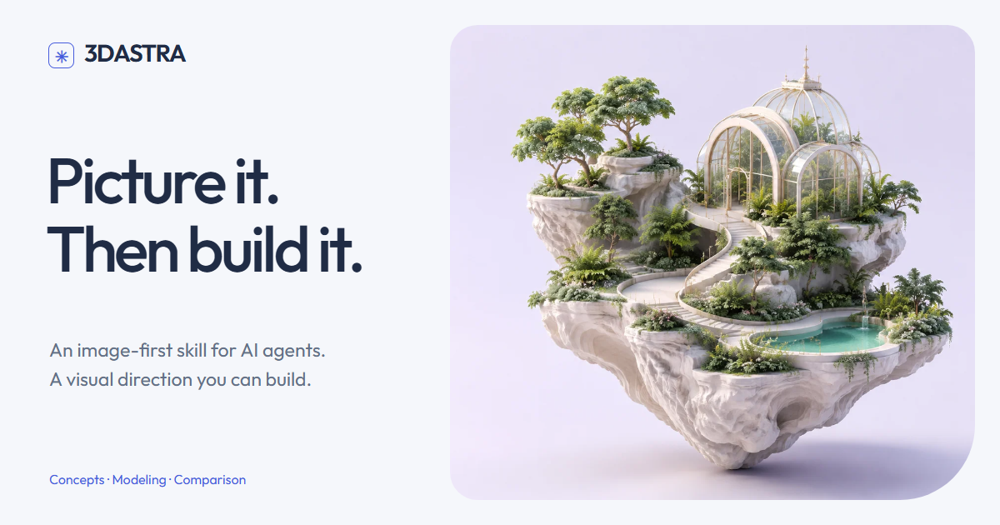

# 3DASTRA

**Picture it. Then build it.**



An image-first skill for AI agents creating 3D scenes and assets. Choose a visual target before detailing geometry, build from coherent references, and compare actual renders throughout production.

[Explore the website](https://3dastra.vercel.app/) · [Download the skill](https://3dastra.vercel.app/downloads/3DASTRA.zip) · [Read SKILL.md](skills/3dastra/SKILL.md)

## What it does

3DASTRA turns broad visual requests into an assessable workflow:

1. Generate or receive concept images and establish the visual target.
2. Prepare only the views, surface studies, and assembly references the build needs.
3. Resolve volumes, silhouette, camera, and contacts before microdetail.
4. Refine materials and lighting in the destination renderer.
5. Compare captures and address the largest visible differences.
6. Measure interactive performance at the actual resolution and quality settings.

It reuses chosen references and existing approvals. Concept-only requests stop at concepts. Local fixes do not restart the whole process. When 60 FPS is the target, higher rates are welcome; the skill does not prescribe an artificial cap.

## Install

Download [3DASTRA.zip](https://3dastra.vercel.app/downloads/3DASTRA.zip), then extract its `3dastra` folder.

**Codex:** place that folder in `~/.codex/skills/`, or `$CODEX_HOME/skills/` if configured. On Windows, the default is `%USERPROFILE%\.codex\skills\3dastra`. Invoke `$3dastra` in a request. If it is not listed in the current session, start a new session or point the agent to its `SKILL.md` file.

**Other agents:** use the installation convention of an environment that supports `SKILL.md` skills. Alternatively, ask the agent to read `skills/3dastra/SKILL.md` and follow its relative references. The agent must be able to access those files. `agents/openai.yaml` is optional Codex interface metadata.

## Example requests

Start from an open direction:

```text
Use $3dastra to create an explorable floating greenhouse.
Generate distinct concept images first and let me choose a target.
Then build the scene from that reference, compare actual captures,
and measure performance with 60 FPS as a target, without an artificial cap.
```

Start from an approved image:

```text
Use $3dastra with the attached, already chosen reference image.
Proceed with the production references, geometry, materials, and lighting
needed to reproduce its visual direction. Preserve the style and verify
the result in the final renderer.
```

Refine existing work:

```text
Use $3dastra to refine this existing 3D product.
Preserve the approved shape and camera. Focus on material scale and
lighting response, then compare captures before and after the change.
```

## What is included

| Resource | Purpose |
| --- | --- |
| [SKILL.md](skills/3dastra/SKILL.md) | Entry points, workflow, scope, and evidence criteria. |
| [Prompts](skills/3dastra/references/prompts.md) | Concepts, construction views, color maps, and focused corrections. |
| [Production checks](skills/3dastra/references/production-checks.md) | Geometry, alpha, UVs, materials, and export checks. |
| [Comparison and performance](skills/3dastra/references/comparison-performance.md) | Comparable captures and honest runtime measurements. |
| [Direction record](skills/3dastra/assets/direction-template.md) | A reusable brief and decision log. |
| [Image inspector](skills/3dastra/scripts/inspect_image.py) | Read-only dimensions, alpha, edge differences, and SHA-256. |

The workflow does not require a specific modeler or image API. A complete production still requires suitable image, modeling, rendering, and profiling tools in the agent's environment. The optional inspector requires Python 3 and Pillow.

```sh
python skills/3dastra/scripts/inspect_image.py path/to/image.png
```

Numerical checks do not certify visual quality, seamless tiling, a coherent PBR material, or a particular frame rate. Those need assessment in the actual project.

## Develop and validate

```sh
python -m pip install -r requirements-dev.txt
python -B -m unittest discover -s tests -p "test_*.py"
python -B tools/package_skill.py
python -B tools/validate.py
```

The package contains only the eight skill files, including its MIT license. Website images and model examples are not included in the skill download.

The [website](site/README.md) is static HTML, CSS, and JavaScript. It builds with Node.js 22 without npm dependencies. Browser verification uses a separately available Playwright installation.

## Contributing

Changes should preserve the user's approved direction, stay within the requested scope, and distinguish generated concepts from actual renders and measurements. Keep references focused and tools portable. Run the checks above when changing the skill or package, and verify the website when changing its behavior.

## License

The skill and code are available under the [MIT license](LICENSE). Showcase images have [separate terms](site/public/images/NOTICE.md). The bundled Outfit font uses the [SIL Open Font License](site/public/fonts/OFL.txt).
